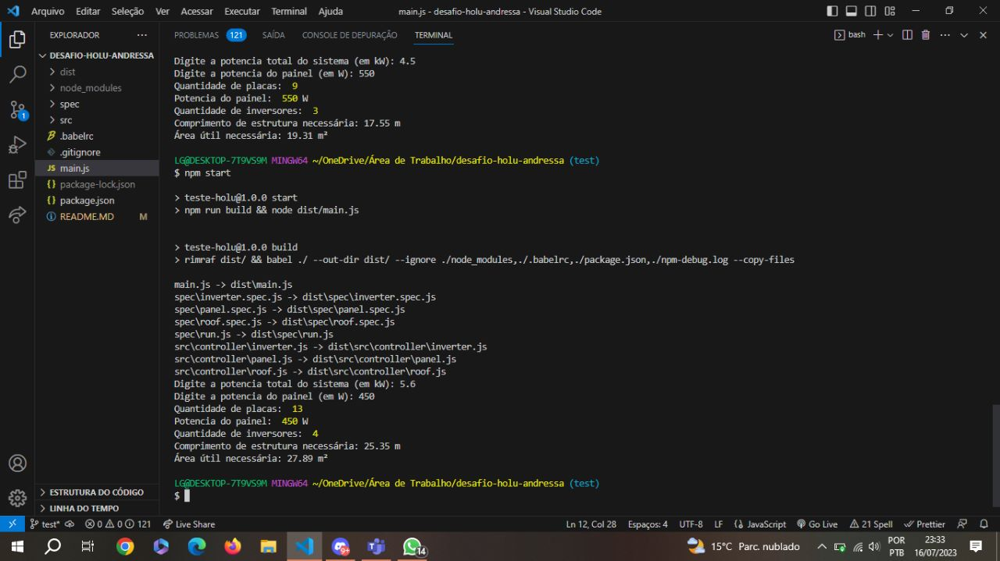

# Desafio Holu
---

---
### Descrição:

- Atualmente no mercado de energia solar fotovoltaica para consumidores residenciais (B2C) frequentemente estão lidando com problemas de viabilizar e dimensionar sistemas solares adequadamente, pois nem todos possui condições ideiais para receber um sistema solar em seu telhado. Com isso teremos que ter uma solução para atender melhor todos os clientes. 

### Variáveis importantes: 

1. Potência e dimensões (comprimento e largura) dos painéis solares
    - Existem vários tipos de painel e seu potencial de geração pode variar em valores como: 350W, 450W, 530W. Com isso, suas dimensões de largura e altura também podem variar bastante. Lembrando que, normalmente, *Watts (W)* é a unidade escolhida para o trabalho, mas você adotar a unidade *kilo Watts (kW)* também.
2. Quantidade de inversores
    - Na Holu, adoramos trabalhar com micro-inversores, componente obrigatório na instalação de um sistema solar. São os responsáveis por transformar a energia gerada de corrente contínua (CC) para corrente alternada (CA). Cada um destes pode se conectar até 4 painéis.
    - Não leve em conta a área de ocupação necessária para os micro-inversores.
3. Tipo de estrutura e comprimento necessário
    - Conhecemos diversos tipos de telhado, como fibrocimento, laje e cerâmica. Cada cliente possui especificações. Seu foco aqui deve ser no comprimento, em metros,  necessário de estrutura, dada a quantidade de painéis encontrada. 

## Objetivo: 

- [x] Crie um script (ou uma aplicação) em NodeJS que receba como parâmetro a potência total de um sistema hipotético (em *kilo Watts*) e retorne a quantidade de placas e inversores, potência do painel utilizado (em Watts), comprimento de estrutura necessária (em metros) e também a área útil (em metros quadrados) necessária para que o sistema seja instalado no telhado. Use as melhores práticas de código e organização que você conhece, será muito importante.

- [x] Considere que o parâmetro recebido será de **4,5 kW**. Sobre o painel solar, considere a potência será de **550W**, o comprimento e largura do painel utilizado será de **1,95m x 1,1 m.** A estrutura será instalada em um telhado feito a base de **laje**.

## 🖥 Tech utilizadas: 

- Node.js
- JavaScript
- Babel
- Git e GitHub
- Jasmine
- readline-sync

## Dificuldades:

1. Compilar o projeto, para aplicar estruturas es2015, conforme o avanço das tecnologias, as vezes isso depende de compiladores;

2. Estruturas semanticas, comp. reutilizaveis, codigo limpo e utilizar sempre boas praticas;

3. Trazer maneiras para que o usuario se comunique com o script;

4. Garantir a funcionabilidade dos codigos de forma individual, em um ambiente OOP sabemos que é usualmente a nível de classes e a mínima unidade de testes inclui construtores e destrutores;

## Soluções: 

1. Para trazer as estruturas mais recentes do javascript como classes, variáveis de instância, utilizai o Babel.

2. OOP (Object-Oriented Programming)

3. Implementação parseFloat `readline.question`

4. Testes unitarios utilizando Jasmine

## Com rodar este projeto:

1. Git Clone 
2. Em seu terminal instale as dependências utilizando `npm install`
3. Logo apos a conclusão, nesse mesmo terminal rode `npm start`

## Opções de testes unitarios:

1. `npm run test`

---
> Desde já agradeço a equipe Holu pela oportunidade em estar participando desse processo seletivo, foi de grande conhecimento e experiência, trouxe consigo excelentes aprendizados. Fico no aguardo do feedback 

